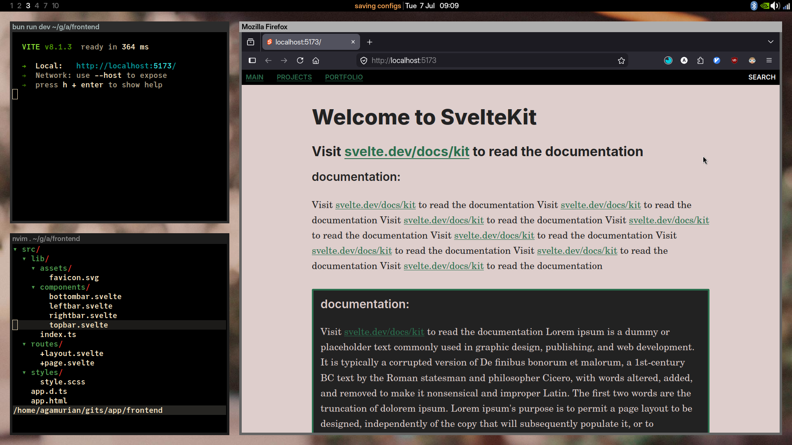

# Sveltekit + Bun + Scss starter pack



To recreate this project with the same configuration:

```sh
# recreate this project
bun x sv@0.16.2 create --template minimal --types ts --add prettier eslint sveltekit-adapter="adapter:node" mcp="ide:claude-code,gemini,opencode+setup:local" experimental="versions:kit+features:async,remoteFunctions,explicitEnvironmentVariables,handleRenderingErrors,forkPreloads" --install bun frontend
```

## Developing

Once you've created a project and installed dependencies with `npm install` (or `pnpm install` or `yarn`), start a development server:

```sh
bun run dev

# or start the server and open the app in a new browser tab
bun run dev -- --open
```

## Building

To create a production version of your app:

```sh
bun run build
```

You can preview the production build with `npm run preview`.

> To deploy your app, you may need to install an [adapter](https://svelte.dev/docs/kit/adapters) for your target environment.
