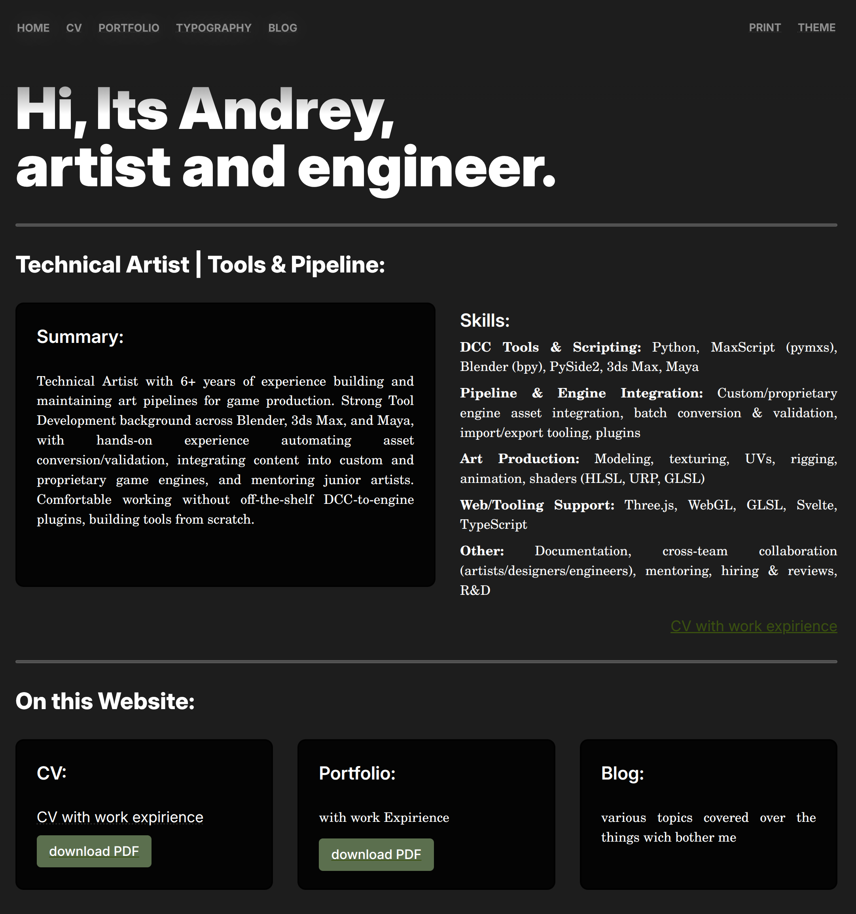
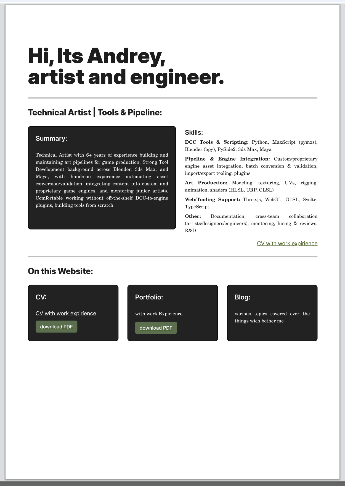

# Sveltekit | Scss | MdSvex starter pack

#### How dows it look:


#### How dows it prints / saves as pdf:


## Developing

Once you've created a project and installed dependencies with `npm install` (or `pnpm install` or `yarn`), start a development server:

```sh
bun run dev

# or start the server and open the app in a new browser tab
bun run dev -- --open
```

## Building

To create a production version of your app:

```sh
bun run build
```

You can preview the production build with `npm run preview`.

---

##### ```adapter-static``` is used, but ```adapter-node``` is possible also.

this is static site generator.
pages are prenrendered, hot reloading and best ever dx
